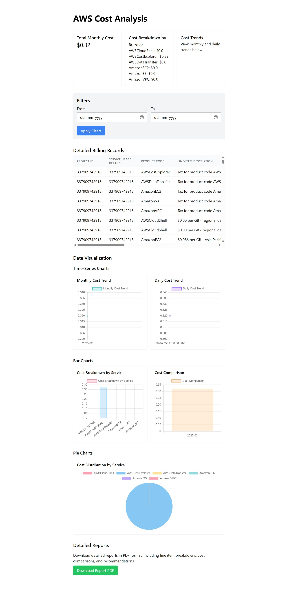
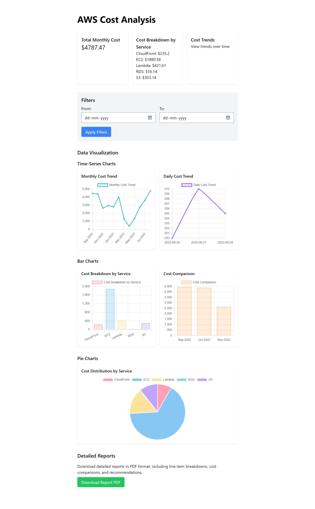

# AWS Billing Analysis Tool

## Project Overview

This advanced Elixir Phoenix application provides a comprehensive AWS billing analytics platform, leveraging real-time data processing, interactive visualizations, and dynamic filtering capabilities. Designed to transform complex AWS billing data into actionable insights, the tool demonstrates sophisticated cloud cost management techniques.

## Technical Architecture

### Key Technologies
- Elixir Programming Language
- Phoenix LiveView
- AWS Cost and Usage Report (CUR) Integration
- Data Visualization Techniques
- Responsive Web Design with Tailwind CSS

### Core Features

#### Dynamic Data Processing
- Real-time parsing of AWS Cost and Usage Reports
- Sophisticated data aggregation algorithms
- Flexible date-range filtering
- Comprehensive cost analysis computations

#### Advanced Visualization Capabilities
- Interactive time-series charts
  - Monthly cost trend visualization
  - Daily cost fluctuation analysis
- Detailed bar charts representing:
  - Cost breakdown by service
  - Comparative cost analysis
- Pie chart for service cost distribution

#### Data Transformation Techniques
- Robust error handling
- Intelligent data parsing
- Flexible date comparison methods
- Comprehensive billing record display

### Endpoint Capabilities

#### `/awstest` Endpoint
Demonstrates precise AWS Cost and Usage Report retrieval with:
- Data extraction from AWS billing APIs
- Comprehensive parsing and aggregation
- Visualization of available billing insights
- Proof of concept for cloud billing data integration

#### `/index` Endpoint
Provides enhanced data visualization through:
- Randomly generated sample data
- Comprehensive cost scenario simulation
- Detailed analytical representations
- Consistent visualization regardless of data source limitations

### Technical Highlights

- Modular LiveView architecture
- Advanced filtering mechanisms
- Dynamic chart rendering
- Secure environment variable management
- Comprehensive error logging

## Screenshots

*A comprehensive overview of AWS Cost & Usage Report (CUR) data showcasing key billing insights and trends.*

*Visualization generated from sample data, mirroring a production AWS paid account's billing analysis and filtering capabilities.*

## Security Considerations

- Secure management of AWS credentials via environment variables
- Robust error handling and logging
- Implemented with best practices for handling sensitive financial data

## Performance Optimization

- Efficient data processing using Elixir's functional programming paradigms
- Minimal memory overhead
- Fast rendering of complex billing datasets

## Technical Requirements

### Prerequisites
- Elixir
- Phoenix Framework
- AWS Account with Billing API access

### Required Environment Variables
- `AWS_SECRET_ACCESS_KEY`
- `AWS_ACCESS_KEY_ID`
- `AWS_DEFAULT_REGION`